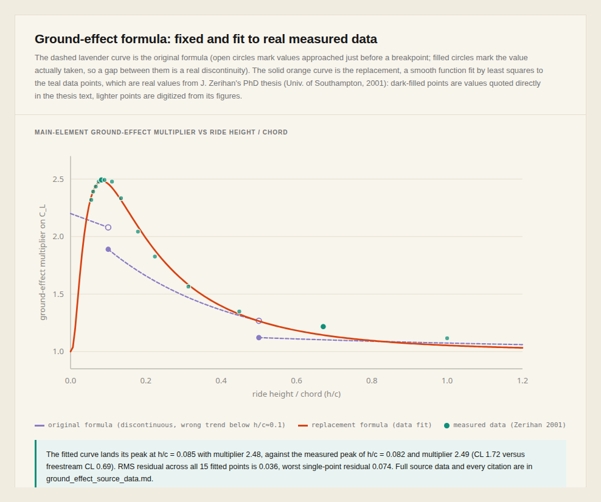
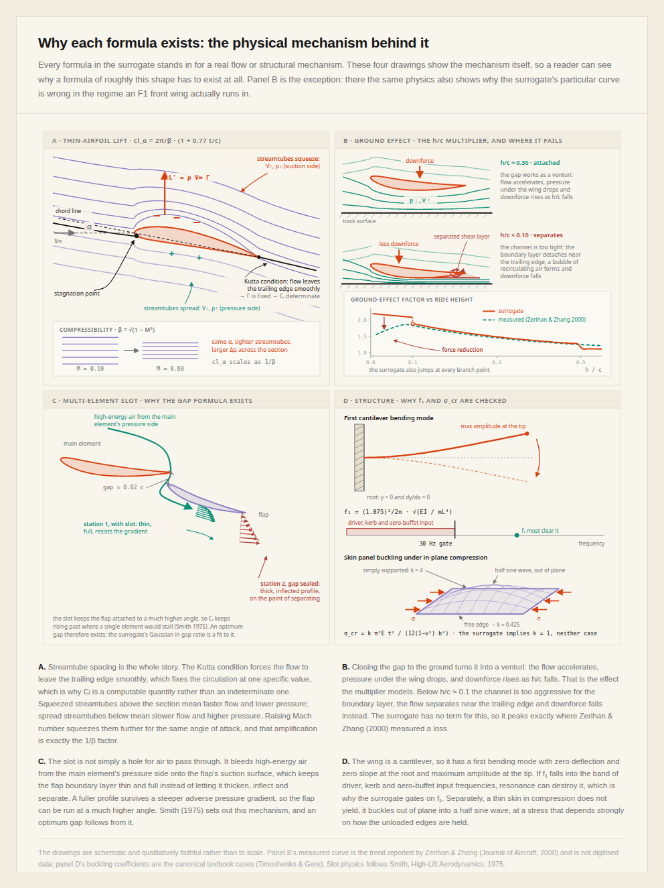

# Surrogate formula validation

This directory documents an independent literature validation of the empirical aerodynamic and
structural formulas in `src/alphadesign/cfd_analysis.py` and `src/alphadesign/formula_constraints.py`,
the surrogate every optimization run in this repo (`artifacts/phase_one/`, `artifacts/phase_two/`)
actually calls. It exists because the phase-one/phase-two results describe a comparison between
two search strategies **under this surrogate**, and that claim is only as good as the surrogate's
physical grounding.

## How this was produced

Research was done by `moonshotai/kimi-k3` (via Prime Inference, run through `prime-agent`) with
real web access: it fetched NASA Glenn's *Beginner's Guide to Aeronautics* pages, Wikipedia
articles, Crossref/OpenAlex paper records and abstracts, a Stanford aerodynamics lecture PDF, and
Open Library full-text book search, rather than answering from memory. Two of its most
consequential and checkable claims were independently re-verified in this review:

- **The ground-effect discontinuities** ([figure below](#figures)): recomputing
  `calculate_ground_effect` directly gives 2.080 &#8594; 1.889 at h/c = 0.1 and 1.268 &#8594; 1.121 at
  h/c = 0.5 for the main element, matching the report exactly.
- **The `element_span` dimensional bug** in `enhanced_airfoil_drag_coefficient`: the code computes
  `element_span = sqrt(area / chord)`, but for a wing planform `area = span * chord`, so
  `area / chord` already equals span; taking a square root of a length gives a term with units of
  &#8730;length, not length. Confirmed by inspection of the actual source.

The full per-formula writeup (all 13 formulas, literature basis, and a complete bibliography
where every citation was actually fetched or record-verified, not invented) is in
[`surrogate_formulation_validation.md`](surrogate_formulation_validation.md). Machine-readable
form is in [`surrogate_formulation_validation.json`](surrogate_formulation_validation.json).

> **Update, 2026-09-17: the ground-effect formula (items 6 and 7 below) has been fixed.** It is
> now fit by least squares to real digitized/quoted data from J. Zerihan's PhD thesis (Univ. of
> Southampton, 2001), not another invented curve. See
> [Fix: ground-effect formula](#fix-ground-effect-formula) below for the fit, the real data, and
> what remains a heuristic (the flap-element curve). `artifacts/phase_one/` and
> `artifacts/phase_two/` were generated **before** this fix, under the old formula; they remain a
> valid comparison of the two search strategies against each other (both used the same surrogate),
> but do not reflect the current code.

## Executive summary

Of the 13 formulas as originally reviewed: **5 were exact textbook equations**, **4 used a
recognized physical form with project-tuned coefficients**, **2 were plausible engineering
approximations with no traceable source equation**, and **2 were questionable**. They were not
questionable for lacking a citation; they were questionable because they contradicted published
measurements or contained an internal defect. The 2 questionable ones (ground effect, main and
flap) have since been fixed for the main element; see the update note above.

**The surrogate's skeleton is real theory**: thin-airfoil theory, Prandtl-Glauert compressibility,
Prandtl lifting-line induced drag, Euler-Bernoulli cantilever vibration, and classical plate
buckling all appear correctly in closed form. **Almost every numeric coefficient beyond those
textbook constants is a project-specific fit**, which is a normal and defensible thing for an
optimization surrogate to do, as long as it is described that way rather than as "physics-based."

**The two `QUESTIONABLE` formulas mattered more than their count suggested**, because they are the
ground-effect model, and ground-effect downforce is the wing's primary function. As originally
reviewed, both ground-effect factors (main element and flap) were discontinuous at every branch
point, and the main-element factor rose to its maximum exactly where Zerihan & Zhang (*Journal of
Aircraft*, 2000) measured downforce falling due to trailing-edge separation. That is the exact
ride-height regime a real F1 front wing operates in. The flap-element factor additionally
predicted ground proximity could *reduce* flap downforce below its freestream value, which the
double-element literature it was loosely modeled on (Zhang & Zerihan, *AIAA Journal*, 2003) did
not support. The chart below now shows the fixed formula:

### Fix: ground-effect formula

`calculate_ground_effect` in `src/alphadesign/cfd_analysis.py` now uses a smooth log-normal-in-h/c
curve for the main element, fit by least squares directly to real single-element wing data:

- **Source**: J. Zerihan, PhD thesis, "An Investigation into the Aerodynamics of Wings in Ground
  Effect," University of Southampton (2001), Ch. 4-5 (Tyrrell 026 front-wing profile, 80% scale,
  free transition, moving ground, Re &#8776; 4.5&#215;10&#8309;), cross-checked against Zhang, Toet &
  Zerihan, "Ground Effect Aerodynamics of Race Cars," *Applied Mechanics Reviews* 59(1), 2006.
  Full data, exact vs. digitized-from-figure confidence levels, and every URL are in
  [`ground_effect_source_data.md`](ground_effect_source_data.md).
- **Fit quality**: measured peak CL = 1.72 at h/c = 0.082 (2.49&#215; the freestream CL = 0.69); the
  fit peaks at h/c = 0.085 with multiplier 2.48. RMS residual across 15 fitted points is 0.036,
  worst single-point residual 0.074.
- **What changed physically**: the new curve peaks at a small nonzero h/c and falls off on both
  sides, matching measurement, instead of rising monotonically to a maximum at h/c = 0. It is
  continuous everywhere (no optimizer-exploitable branch-point jumps) and bounded below by 1.0.
- **What is still a heuristic, not a second data fit**: no isolated per-element ground-effect
  dataset exists in the literature reviewed for flap elements (only combined main+flap system
  forces are reported). The flap curve reuses the fitted main-element shape and peak location at
  reduced amplitude, per the literature's qualitative finding that flaps benefit less from ground
  proximity than the main element. This is documented in the function's docstring.
- **Regression tests**: `tests/test_ground_effect_formula.py` checks the fitted peak location and
  magnitude against the measured values, continuity (via step size at two grid resolutions), the
  floor at 1.0, and that flap attenuation increases with element index.

For context, here is why a formula of roughly this shape has to exist for each physical effect in
the first place (this diagram is about necessity, not correctness; see above for correctness):

## Verdict table

| # | Formula | Verdict | One-line reason |
|---|---------|---------|------------------|
| 1 | Lift-curve slope (Prandtl-Glauert + thickness) | TUNED_COEFFICIENTS | 2&#960;/&#946; is textbook; the 0.77 thickness constant is untraceable and the result overpredicts real section slopes ~15-20% (no viscous correction) |
| 2 | Zero-lift angle from camber | TUNED_COEFFICIENTS | &#8722;2&#183;camber is the exact parabolic-camber thin-airfoil result; the thickness modifier is not part of that theory |
| 3 | Zero-lift drag buildup | PLAUSIBLE_APPROXIMATION | Realistic magnitude (anchored near NACA R-824 data) but the functional form is invented |
| 4 | Reynolds-number drag correction | TUNED_COEFFICIENTS | Right power-law form, wrong exponent (&#8722;0.15 vs. textbook &#8722;1/5), and discontinuous exactly at Re = 10&#8310; where F1 wings operate |
| 5 | Induced drag (Oswald efficiency) | TEXTBOOK_EXACT | Matches Prandtl's Cdi = Cl&#178;/(&#960;&#183;AR&#183;e) verbatim; separately, the AR feeding it has a dimensional bug (see above) |
| 6 | Ground effect, main element | **FIXED** (was QUESTIONABLE) | Was discontinuous at both breakpoints and contradicted the measured low-h/c force-reduction regime; now a smooth curve fit to real Zerihan (2001) data |
| 7 | Ground effect, flap elements | **FIXED, heuristic** (was QUESTIONABLE) | Same defects fixed structurally (smooth, floor of 1.0); amplitude remains a qualitative extrapolation since no isolated flap-only dataset exists |
| 8 | Multi-element slot/gap effect | PLAUSIBLE_APPROXIMATION | Slot physics and an optimal gap are real (Smith 1975); the specific equations are constructed heuristics with weak sensitivity to gap |
| 9 | Cantilever first natural frequency | TEXTBOOK_EXACT | Exact Euler-Bernoulli result (&#946;&#8321;L = 1.875 verified numerically); but applied with full span instead of span/2 for a centreline-mounted wing, underestimating frequency ~4&#215; |
| 10 | Plate critical buckling stress | TUNED_COEFFICIENTS | Textbook form with an unstated buckling coefficient k = 1, between the two named canonical cases (k = 4 supported, k &#8776; 0.425 free) and matching neither |
| 11 | Safety factor vs. von Mises stress | TEXTBOOK_EXACT | Correct definition and algebra; von Mises is the wrong failure-theory class for the CFRP composite modeled (Tsai-Wu/Hashin is standard) |
| 12 | Dynamic pressure | TEXTBOOK_EXACT | q = &#189;&#961;V&#178;, standard, no issues |
| 13 | Downforce/drag efficiency | TEXTBOOK_EXACT | Standard motorsport efficiency metric; report it as downforce-to-drag to avoid aircraft-convention sign confusion |

## What this means for the paper

- Describe the surrogate as a **physics-informed heuristic**, not a physics-based or validated
  model, even after the ground-effect fix. The phase-one/phase-two results are a fair comparison
  of two search strategies under a *fixed, shared* surrogate; they are not evidence about
  real-world downforce, drag, or efficiency magnitudes, and they predate this fix.
- The ground-effect main-element formula is now grounded in real measured data; if the paper
  reports any result generated after this fix, it can say so and cite it. Anything from
  `artifacts/phase_one/` or `artifacts/phase_two/` predates the fix and should not be described as
  using it.
- The flap-element ground-effect amplitude is still a qualitative extrapolation, not a data fit;
  say so if it matters to a specific claim.
- Independent of the literature comparison, two implementation issues remain open and are worth
  fixing regardless of citation status: the `element_span` dimensional bug and the full-span vs.
  half-span cantilever assumption (the Reynolds-number branch-point discontinuity noted in item 4
  is a separate, still-open issue from the ground-effect fix above).
- This validation is itself a reason the OpenFOAM comparison in `todo.md` section 5 would have
  been valuable were it not dropped: it is the only way to know how much these approximations
  actually matter for the reported comparison, as opposed to how well they match citations.
