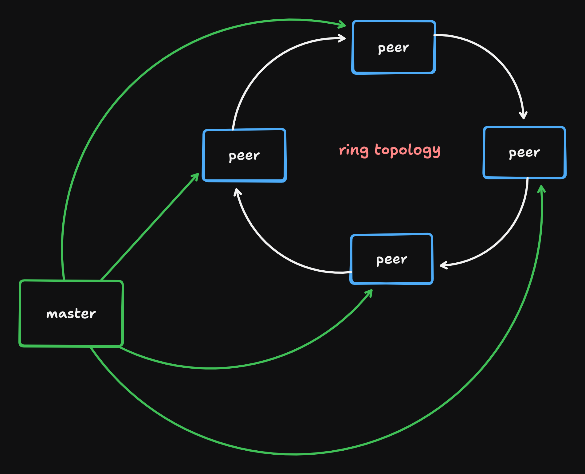

# PCCL: Notes 

Paper link: https://arxiv.org/pdf/2505.14065

Read the Prime Intellect paper on PCCL and dug in. This is one of those rare “we actually built it to survive the real internet” comms stacks. Not a facelift on HPC assumptions. A rethink around churn, WAN latency, and training loops that must stay bit-aligned without babying the system.

## Why this exists

Classic collectives (MPI/NCCL) assume the world is kind: fixed membership, stable links, low jitter, symmetric throughput. Over the public internet, none of that holds. Peers arrive late, drop mid-iteration, and routes behave asymmetrically. PCCL is built for that world: dynamic peers, interruptible collectives, and state that remains bit-identical despite chaos.

## Master–client model (and why “authoritarian” is good)

There’s a master, and there are peers. The master doesn’t move bytes for your tensors; it coordinates. It tracks who’s in, who’s applying, what the ring is, and whether anyone is out of sync. That tight control isn’t overhead for the sake of it—it’s how you shrink the legal state space so failure handling is tractable instead of combinatorial.

Peer lifecycle is strict for a reason:
- Request → Registered → Accepted (Active group)
- Only accepted peers participate in collectives and vote to admit newcomers
- No free-for-all joining in the middle of a collective

That discipline lets you unwind errors deterministically and avoid “zombie” states that stall the run.

## Topology: ring order by bandwidth, not vibes

All-reduce is ring-based here. Order matters a lot when your links are WAN. PCCL measures pairwise bandwidth and treats ring construction like an asymmetric TSP. Asymmetric is key: A→B may not equal B→A thanks to routing reality.

Two passes:
- Fast heuristic to get you moving now
- Background “moonshot” to improve the ring later

When a better order appears, peers rewire their p2p links. Colocated machines naturally cluster; cross-DC hops get minimized. Practical, not precious.

## Shared state: bit parity or it didn’t happen

Every accepted peer is expected to have the exact same weights and optimizer state. PCCL enforces this by hashing the shared state and letting the master spot stragglers. Out-of-date peers pull the missing bytes p2p from an up-to-date one. The hashing kernel is deterministic across GPU generations and mirrored on CPU with the same reduction shape so the identity holds. Result: no silent drift, no accidental forked worlds.

## One major thing at a time

PCCL’s golden rule: a group does only one major operation at a time.
- Accept/remove peers (topology update)
- Sync shared state
- Run a collective

Everything is gated via micro-consensus. That’s how you guarantee lockstep semantics and make abort-and-retry safe. If a peer dies mid-collective, the operation is canceled, the peer is marked gone, and you retry without it. Buffers roll back to pre-op contents—no half-applied garbage.

## The all-reduce, built for aborts

The implementation is the N−1 ring you expect, pipelined and chunked:
- Reduce-scatter: accumulate your slice over world_size−1 steps
- All-gather: circulate the completed slices until everyone has the full tensor
- Finalize (AVG divides by world_size, etc.)

Crucially, the send/recv loop periodically checks for master abort signals without adding IO overhead. On abort, local state restores immediately to a snapshot taken at start-of-op. Zero-copy still applies: user buffers are used directly, but the system remains interruptible.

## Make WAN your ally: concurrency and multi-connection

Single TCP flow over a long fat pipe rarely hits line rate thanks to window growth and per-flow fairness. PCCL exploits multiple concurrent TCP connections and concurrent collectives:
- Multiple parameter tensors can reduce concurrently
- Multiple TCP flows per peer-to-peer link lift aggregate throughput on WAN
- Effective bandwidth is the sum over those overlapping ops

This is the Internet version of “don’t starve the pipe.”

## Algorithms this actually enables

- DDP: straightforward with PCCL primitives, but chatty over WAN. Works, not ideal.
- DiLoCo: inner steps train locally for H steps, outer step reduces parameter deltas and applies with an outer optimizer. Turn H up to reduce comms; at H=1 with SGD(1.0) it approximates DDP.
- Async DiLoCo: overlap comms with compute. Compute the delta, launch reduce in the background, keep training. Apply the reduced update one outer step later. If compute time roughly matches comms, you effectively hide the comm cost.

Peer churn with Async DiLoCo needs choreography:
- Don’t overlap major ops with collectives
- Drain in-flight collective, then accept newcomers and sync once
- New peers “eavesdrop” the just-finished outer state via an extra shared-state sync to land in exact bit-parity
- Resume the one-step-behind pipeline

## Fault tolerance is a design constraint, not an afterthought

Previous attempts failed because “join whenever” makes the state machine explode. PCCL narrows legal transitions, demands consensus, and tests hard:
- Long-running stress tests kill and respawn peers every ~0.5–1s
- Mixed OS socket behavior is handled by design and CI, not wishful thinking
- Threading primitives are tuned to saturate full-duplex links without introducing wakeup latency bottlenecks

The result isn’t magic; it’s engineering guardrails.

## What this unlocks in practice

- Training across DCs and clouds without a VPN
- Spot-heavy fleets with a small reliable master keeping the run coherent
- Exact state recovery: peers restore to the last verified shared-state hash, avoiding “mystery divergence” after restart
- Research room for comm-lean optimizers and dynamic membership strategies without re-implementing fault tolerance from scratch

## Mental model to keep in your head

- Master is control plane only. Data planes are peer-to-peer.
- Groups advance via small unanimous votes. If anything’s off, abort quickly and retry from a clean, known state.
- Topology is a living thing. Measure, solve, rewire, repeat.
- Determinism beats heroics. Hash, verify, sync. Then go.

## Quick checklist if you’re integrating

- Wire up the communicator per trainer process; connect to master early
- Admit peers only through the accept phase; never side-door them
- Call topology update at sensible cadence; let the solver improve the ring
- Enforce shared-state sync before first collective after membership change
- Batch parameter tensors to enable concurrent reduces
- For Async DiLoCo, build the one-step-behind application and the double-sync join path

## Closing take

PCCL treats the internet like the hostile substrate it is and still keeps model state bit-aligned across churn. The strict FSM and micro-consensus aren’t ceremony—they’re how you make abortable, zero-copy collectives safe at scale. If you need WAN-grade collectives with dynamic membership and you care about exactness, this is the right set of trade-offs.
