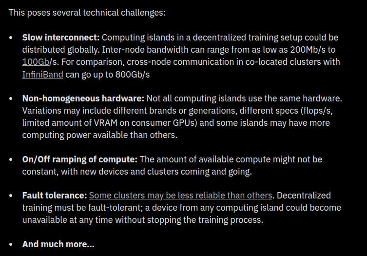
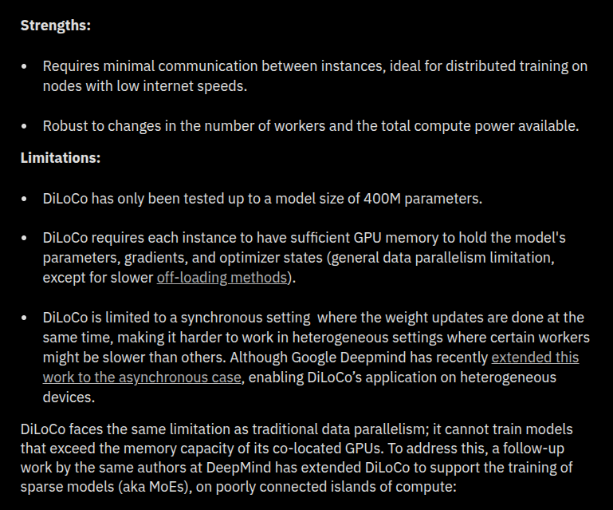
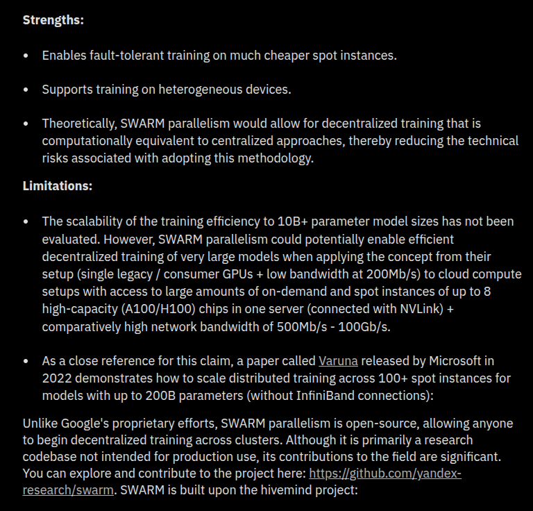

# Understand distributed training

So our goal is to cluster 4 of our laps, and then train them on 4 diff things, and also pool them for another a value network valuation, and then get the reward to optimize the policy in each one them.

Detailed diagram:

The first blog I'm going through this from [primeintellect.ai](https://primeintellect.ai/). The link: https://www.primeintellect.ai/blog/our-approach-to-decentralized-training

Coz i think they solve the same problem, pooling resources from around the world, and use them to train models.

---
## Important takeaways:

> In the decentralized training paradigm, we have access to relatively cheap compute power, but communication between instances is costly. For instance, we could harness unused compute (e.g., cheap spot instances) from various sources, but with the drawback that these instances can be located all around the world.

> **Distributed Low-Communication Training (DiLoCo)**: instead of syncing the gradient at every step you would sync only every 500 steps? This would spread the 16 seconds of communication over minutes of computation, maximizing GPU utilization and reducing training time. DiLoCo introduces an inner-outer optimization algorithm that allows both local and global updates. Each worker independently updates its weights multiple times using a local AdamW optimizer (inner optimization). Every ~500 updates, the algorithm performs an outer optimization using the Nesterov momentum optimizer, which synchronizes all workers' pseudo gradients (the sum of all local gradients).
.png)

> **DiPaCo: Distributed Path Composition**:** DiPaCo use a coarse routing mechanism. This routing is made at the sequence level (to contrast with token level), greatly reducing the amount of communication needed at each step. Additionally, the routing decisions are made offline before training, allowing data to be pre-sharded. Each worker then processes data specific to one path only. In their experiments, they trained a sparse model with 256 possibles path, each having 150m active parameters which outperforms a 1B dense parameter model baseline. Each of these paths are not totally independent, otherwise the approach would be equivalent to train 256 different models. The paths share common blocks that are kept in sync using DiLoCo.
.png)

> SWARM Parallelism: presents a more flexible form of pipeline parallelism. The path for completing a full forward and backward pass is not fixed and may vary over time. Each worker may send its output to any other worker in the subsequent stage. Faster devices receive more tasks to prevent GPU idle time, and also enabling the use on non-homogeneous hardware. If a worker dies, the tasks assigned to it are redirected to others, making the algorithm fault tolerant. Paths are determined stochastically and on the fly. Each worker in a stage is placed in a priority queue based on its recorded performance in the pipeline over time. Workers that consistently perform tasks faster—due to better hardware or are co-located with preceding workers—are more likely to be picked. If a worker fails to respond to a request, it is temporarily excluded from the queue until it re-announces itself. This dynamic allows the system to operate on preemptible instances or adaptively rebalance nodes within the swarms.

---

This blog goes on with one more methods like **Varuna**, and something. Why i thought i need this base is coz, 1. I want to understand how to pool resources from different machines, and use them for training. 2. I want to understand how to reduce communication overhead.

But this blog has nothing to do with my thing, as my training is gonna happen as in diff models in each lap, not sharded or distributed training of same model. the only thing i need to do now is, how to establish a central connection for only the queue thing.

---
W*t**, i found the idea

so need to **host only the queueing server in a central location**, and each need to just connect to it, by **websocket**, and then send or receive messages from it.

---

But still, i need to centrally monitor the training, for that i need to collect the resources first and then deploy seperate docker containers in each of them, and then start the training. But **fault-tolerance** is not needed as such, coz if one training fails, only that lap is affected, other 3 can continue. It is not needed as of now. But need to think of it as well. And also need to establish a **p2p connection** between the central server and each of the training nodes.

