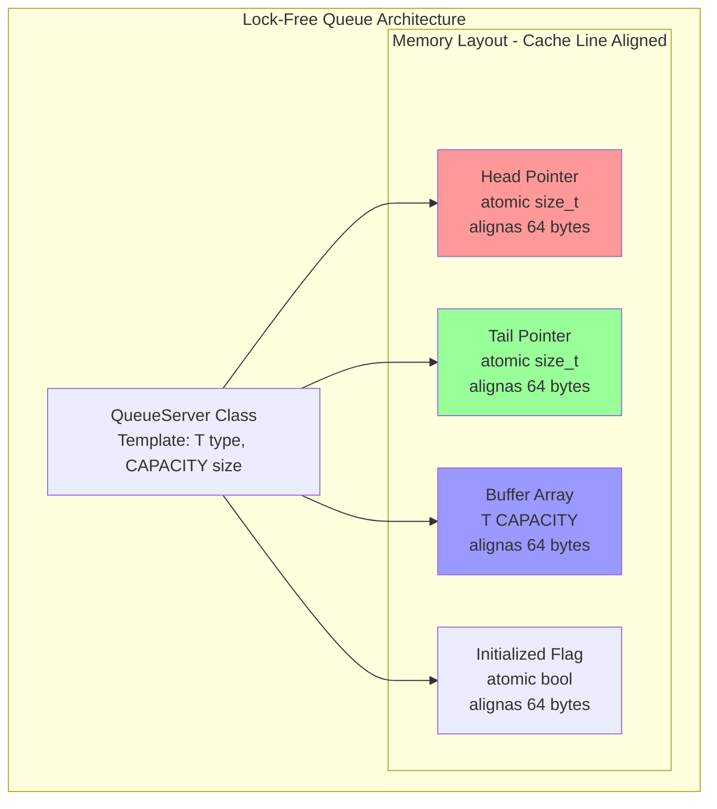
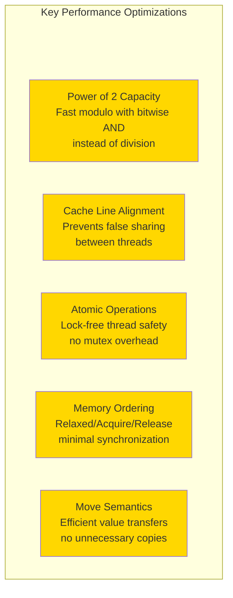
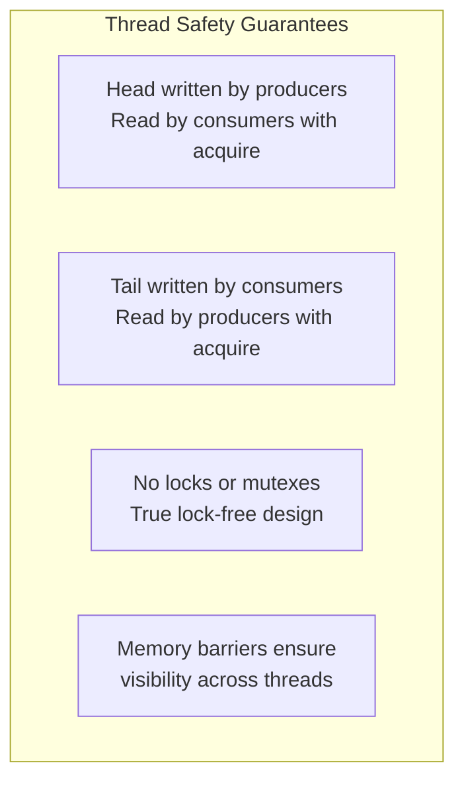
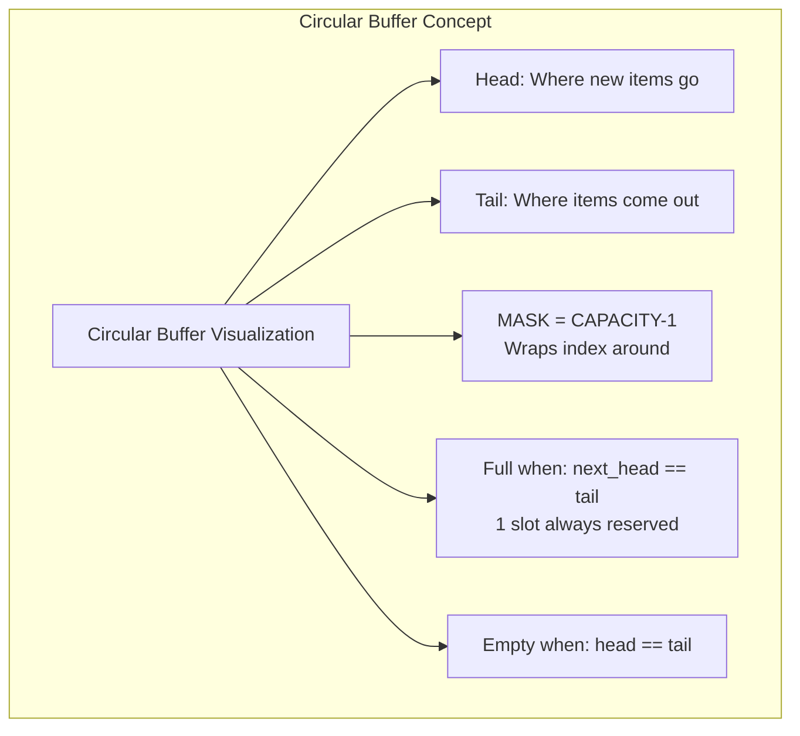

# Queue Server

This project implements a high-performance, lock-free queue server designed for efficient inter-process communication. The queue server supports multiple producers and consumers, allowing for concurrent enqueue and dequeue operations without the need for traditional locking mechanisms.

Heavily inspired from this repo: https://github.com/andersc/fastqueue

## Part 1: Lock-Free Queue Architecture & Memory Layout

So this is the core structure of the queue. It's a templated class that takes any type T and a fixed capacity. The key thing here is that every atomic variable gets its own 64-byte cache line using alignas. This prevents false sharing where different CPU cores would trash each other's caches when accessing nearby memory locations. Each atomic sits in its own cache line so threads can work independently without constantly invalidating each other's cached data.

***

## Part 2: Enqueue Operation Flow

When you add something to the queue, it first checks if the queue is even alive. Then it loads the current head position with relaxed ordering since we're just reading our own data. The magic happens with the MASK - it wraps the index around using bitwise AND instead of slow modulo operations. Before writing, we check if the queue is full by seeing if the next head position would collide with the tail. If there's space, we write the value and update the head pointer with release semantics so other threads can see the change.

```mermaid
graph TB
    subgraph "Enqueue Operation Flow"
        ENQ_START[Start Enqueue<br/>with value]

        space1[ ]

        ENQ_CHECK1{Is Queue<br/>Initialized?}

        space2[ ]

        ENQ_LOAD[Load current head<br/>memory_order_relaxed]

        space3[ ]

        ENQ_CALC[Calculate next_head<br/>using MASK<br/>next = current+1 & MASK]

        space4[ ]

        ENQ_LOAD_TAIL[Load tail<br/>memory_order_acquire]

        space5[ ]

        ENQ_CHECK2{Is Queue Full?<br/>next_head == tail}

        space6[ ]

        ENQ_WRITE[Write value to<br/>buffer current_head]

        space7[ ]

        ENQ_UPDATE[Update head pointer<br/>memory_order_release]

        space8[ ]

        ENQ_SUCCESS[Return true]
        ENQ_FAIL[Return false]

        ENQ_START --> space1
        space1 --> ENQ_CHECK1
        ENQ_CHECK1 -->|No| ENQ_FAIL
        ENQ_CHECK1 -->|Yes| space2
        space2 --> ENQ_LOAD
        ENQ_LOAD --> space3
        space3 --> ENQ_CALC
        ENQ_CALC --> space4
        space4 --> ENQ_LOAD_TAIL
        ENQ_LOAD_TAIL --> space5
        space5 --> ENQ_CHECK2
        ENQ_CHECK2 -->|Yes Full| ENQ_FAIL
        ENQ_CHECK2 -->|Not Full| space6
        space6 --> ENQ_WRITE
        ENQ_WRITE --> space7
        space7 --> ENQ_UPDATE
        ENQ_UPDATE --> space8
        space8 --> ENQ_SUCCESS
    end

    style ENQ_SUCCESS fill:#90EE90
    style ENQ_FAIL fill:#FFB6C6
    style space1 fill:none,stroke:none
    style space2 fill:none,stroke:none
    style space3 fill:none,stroke:none
    style space4 fill:none,stroke:none
    style space5 fill:none,stroke:none
    style space6 fill:none,stroke:none
    style space7 fill:none,stroke:none
    style space8 fill:none,stroke:none
```

***

## Part 3: Dequeue Operation Flow

Dequeue is basically the reverse operation. We load the tail position with relaxed ordering and check the head with acquire semantics to make sure we see any new items that were added. If tail equals head, the queue is empty and we return nullopt. Otherwise, we read the value using move semantics to avoid copies, calculate the next tail position with the MASK, and update the tail pointer with release ordering. The return type is optional since the operation might fail if the queue is empty.

```mermaid
graph TB
    subgraph "Dequeue Operation Flow"
        DEQ_START[Start Dequeue]

        space1[ ]

        DEQ_CHECK1{Is Queue<br/>Initialized?}

        space2[ ]

        DEQ_LOAD_TAIL[Load current tail<br/>memory_order_relaxed]

        space3[ ]

        DEQ_LOAD_HEAD[Load current head<br/>memory_order_acquire]

        space4[ ]

        DEQ_CHECK2{Is Queue Empty?<br/>tail == head}

        space5[ ]

        DEQ_READ[Read value from<br/>buffer current_tail<br/>using move]

        space6[ ]

        DEQ_CALC[Calculate next_tail<br/>using MASK<br/>next = current+1 & MASK]

        space7[ ]

        DEQ_UPDATE[Update tail pointer<br/>memory_order_release]

        space8[ ]

        DEQ_SUCCESS[Return value<br/>in optional]
        DEQ_FAIL[Return nullopt]

        DEQ_START --> space1
        space1 --> DEQ_CHECK1
        DEQ_CHECK1 -->|No| DEQ_FAIL
        DEQ_CHECK1 -->|Yes| space2
        space2 --> DEQ_LOAD_TAIL
        DEQ_LOAD_TAIL --> space3
        space3 --> DEQ_LOAD_HEAD
        DEQ_LOAD_HEAD --> space4
        space4 --> DEQ_CHECK2
        DEQ_CHECK2 -->|Yes Empty| DEQ_FAIL
        DEQ_CHECK2 -->|Not Empty| space5
        space5 --> DEQ_READ
        DEQ_READ --> space6
        space6 --> DEQ_CALC
        DEQ_CALC --> space7
        space7 --> DEQ_UPDATE
        DEQ_UPDATE --> space8
        space8 --> DEQ_SUCCESS
    end

    style DEQ_SUCCESS fill:#90EE90
    style DEQ_FAIL fill:#FFB6C6
    style space1 fill:none,stroke:none
    style space2 fill:none,stroke:none
    style space3 fill:none,stroke:none
    style space4 fill:none,stroke:none
    style space5 fill:none,stroke:none
    style space6 fill:none,stroke:none
    style space7 fill:none,stroke:none
    style space8 fill:none,stroke:none
```

***

## Part 4: Key Performance Optimizations

These are the techniques that make this thing actually fast. Power of 2 capacity lets us use bitwise AND for wrapping indices which is way faster than division or modulo. Cache line alignment prevents false sharing between threads. Atomic operations give us lock-free thread safety without the overhead of mutexes. Memory ordering semantics let us use the minimum synchronization needed instead of full barriers everywhere. Move semantics avoid unnecessary copies when transferring values in and out of the buffer.

***

## Part 5: Thread Safety Guarantees

The thread safety model is pretty elegant. Producer threads write to the head pointer and consumers read it with acquire semantics to see the latest data. Consumer threads write to the tail pointer and producers read it with acquire. There are no locks or mutexes anywhere in the code, making it truly lock-free. The memory barriers from acquire and release operations ensure that changes are visible across threads in the right order without needing expensive full barriers.

***

## Part 6: Circular Buffer Concept

The circular buffer is what makes this efficient. Head points to where new items get inserted and tail points to where they get removed. The MASK is just CAPACITY minus 1, and since capacity is a power of 2, we can use it for fast wrapping with bitwise AND. The queue is full when incrementing head would make it equal to tail, and it's empty when head equals tail. We always keep one slot empty to distinguish between these two states without needing extra flags.

