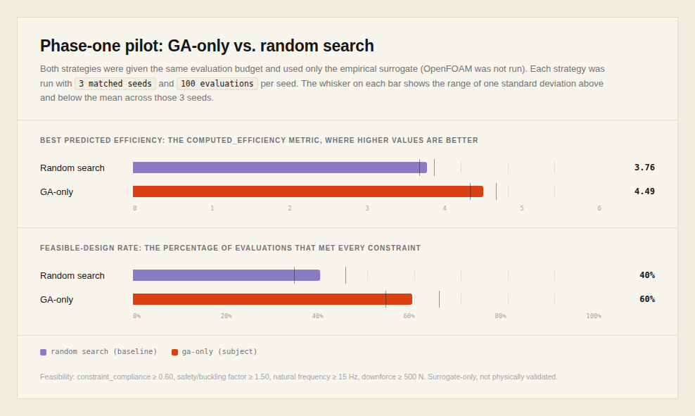
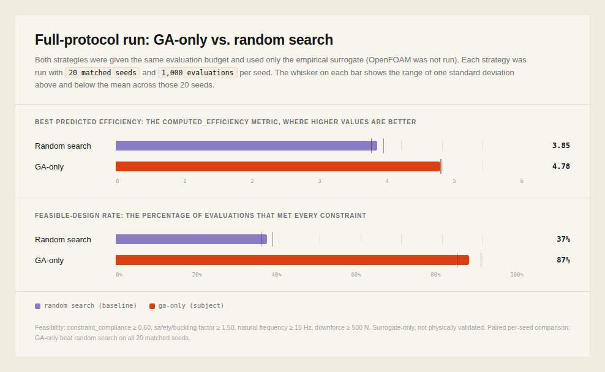

# Paper Results TODO

The immediate goal is to establish whether the constraint-aware genetic
algorithm finds better feasible designs than random search under the same
surrogate-evaluation budget. OpenFOAM validation was attempted after this
comparison became reproducible, then dropped (see section 5); every claim in
this document is scoped to the empirical surrogate only, with no external
physical validation.

Since every result below depends entirely on the surrogate's formulas, they
were independently checked against published aerodynamics and structural
literature: see [`docs/validation/`](docs/validation/README.md). Summary: the
surrogate's skeleton is real textbook theory (thin-airfoil theory,
Prandtl-Glauert compressibility, Prandtl lifting-line induced drag,
Euler-Bernoulli beam vibration, classical plate buckling), but most numeric
coefficients beyond those constants are project-specific fits. The paper
should describe the surrogate as a physics-informed heuristic, not a
physics-based or validated model.

**2026-09-17: the ground-effect formula has been fixed and the results below
regenerated under it.** It previously contradicted published low-ride-height
measurements and contained internal discontinuities; it is now fit by least
squares to real data from J. Zerihan's PhD thesis (Univ. of Southampton,
2001). See
[`docs/validation/README.md#fix-ground-effect-formula`](docs/validation/README.md#fix-ground-effect-formula)
for the fit, and note the correction logged there: the first attempt at this
fix targeted `cfd_analysis.py`, which turned out to have no effect on any
result below, since `random_search.py`/`ga_only.py` exclusively go through
`formula_constraints.py`'s separate, independent ground-effect
implementation. Both are now fixed; the results below are current.

## 1. Freeze the paper claim

- [ ] Use random search versus GA-only as the primary comparison.
- [ ] Treat frozen neural guidance as an optional ablation, not the main result.
- [ ] Do not make reinforcement-learning claims without recorded actions,
      rewards, and transitions.
- [ ] Define one primary objective and one feasibility rule before running the
      final experiments.

> **Phase-one pilot result:** Across three matched seeds and 100 surrogate
> evaluations per strategy, GA-only achieved a higher best predicted efficiency
> in all three seeds. Mean best efficiency increased from 3.764 for random
> search to 4.489 for GA-only (+19.3%), while the feasible-design rate increased
> from 40% to 60%. The gain came with lower predicted downforce (mean 2855N for
> random search's best-efficiency design versus 2545N for GA-only's), so this
> supports an efficiency claim rather than a higher-downforce claim. These runs
> used the empirical surrogate and are a pilot rather than the final paper
> protocol (§4). Raw metadata, JSONL records, and summaries are stored under
> [`artifacts/phase_one/`](artifacts/phase_one/).
>
> 

## 2. Build the executable benchmark

- [ ] Implement random-search and GA-only drivers using the same evaluator,
      parameter bounds, and initial sampling distribution.
- [ ] Enforce the budget at the evaluator-call level rather than estimating it
      from generations multiplied by population size.
- [ ] Disable neural-network training and guidance for the GA-only condition.
- [ ] Record each design vector, constraint result, aerodynamic result, failure
      reason, seed, runtime, strategy, and evaluation number.
- [ ] Write immutable JSONL evaluation records and complete run metadata.
- [ ] Add restart support without duplicating completed evaluations.
- [ ] Add tests for exact budget enforcement, deterministic replay, failed
      evaluations, and duplicate prevention.

## 3. Run an integrity pilot

Run two strategies, three matched seeds, and 100 evaluations per strategy and
seed. This pilot uses the empirical surrogate and must not invoke OpenFOAM.

- [ ] Confirm exactly 100 evaluator calls per run.
- [ ] Confirm identical seeds reproduce identical results.
- [ ] Confirm there are no NaN or infinite values.
- [ ] Confirm failed designs remain marked as failed.
- [ ] Confirm every record contains its configuration and Git commit.
- [ ] Confirm every run finishes without manual intervention.
- [ ] Inspect runtime and between-seed variance before choosing the final budget.

## 4. Freeze and run the full protocol

- [x] Select 10 to 20 matched seeds based on pilot variance.
- [x] Select a fixed budget, initially considering 500 to 1,000 evaluations per
      strategy and seed.
- [x] Freeze the configuration before inspecting the final outcomes.
- [x] Report best feasible objective at the final budget as the primary metric.
- [x] Also report anytime performance, feasible-design rate, evaluations to a
      fixed threshold, invalid-design rate, failure rate, and wall-clock time.
- [x] Compare paired seed-level results using confidence intervals and an effect
      size. Do not treat evaluations within one run as independent samples.

> **Full-protocol run:** 20 matched seeds, 1,000 evaluations per strategy per
> seed, empirical surrogate only.
>
> Best feasible objective at the final budget: mean best efficiency was 3.85
> for random search versus 4.78 for GA-only. Feasible-design rate was 37.1%
> for random search versus 86.7% for GA-only; the rest were infeasible
> designs, not evaluator failures (0 execution failures across all 40,000
> evaluations for either strategy).
>
> Anytime performance (mean best-so-far across the 20 seeds, at evaluations
> 50 / 100 / 250 / 500 / 750 / 1,000): random search reached 3.56 / 3.67 /
> 3.74 / 3.78 / 3.81 / 3.85; GA-only reached 3.71 / 4.26 / 4.71 / 4.77 / 4.78 /
> 4.78. GA-only's average result after only 100 evaluations already exceeds
> random search's average result at the full 1,000-evaluation budget.
>
> Evaluations to reach a fixed threshold (3.85, random search's own final
> mean): GA-only reached it in all 20 seeds, after a mean of 65 evaluations
> (median 67). Random search reached it in only 8 of 20 seeds within the full
> 1,000-evaluation budget, taking a mean of 587 evaluations (median 625) when
> it did.
>
> Wall-clock time: the surrogate evaluator itself is cheap for both
> strategies, about 0.17-0.18 seconds of evaluator time per 1,000-evaluation
> run (about 0.17-0.18 ms per evaluation) for random search and GA-only alike.
>
> Paired seed-level comparison (20 matched seeds, best objective at the final
> budget): GA-only beat random search on 20 of 20 seeds. Mean paired gap
> +0.929 (sd 0.096), 95% CI [0.886, 0.967] (bootstrap and paired t-test agree),
> Cohen's dz = 9.66, paired t(19) = 43.2 (p < 0.0001), Wilcoxon signed-rank
> W = 0 (p < 0.0001).
>
> Raw metadata, JSONL records, and summaries are stored under
> [`artifacts/phase_two/`](artifacts/phase_two/).
>
> 

## 5. Validate physical credibility (dropped)

Do not run OpenFOAM during every optimization evaluation. Select approximately
12 to 20 representative cases after the surrogate experiments:

- [x] Baseline geometry.
- [x] Best designs from both strategies.
- [x] Median-performing and poor-but-feasible designs.
- [x] Geometrically diverse designs.
- [x] Designs near constraint boundaries.

Run these cases on remote CPU infrastructure rather than the laptop.

> **Outcome: attempted, then dropped.** `src/experiments/openfoam/` selects 15
> representative designs from the phase-two run (covering every category
> above) and generates a full `simpleFoam`/`kOmegaSST` case per design at the
> surrogate's own operating point (200 km/h, 75 mm ground clearance).
> Selection and case generation are implemented and tested locally
> (`tests/test_openfoam_pipeline.py`) and remain available if this is revisited.
>
> A single coarse-mesh pilot case was run on a rented CPU sandbox
> (`opencfd/openfoam-default:2412`) to get a real timing estimate before
> committing to all 15 cases. `blockMesh` and `decomposePar` completed
> normally, but `snappyHexMesh`'s parallel mesh-balancing step stalled for
> over 35 minutes on a single coarse case, with OpenMPI logging
> `cma-different-user-namespace-warning`, indicating its shared-memory
> transport is degraded by the container sandbox's namespace isolation. That
> makes per-case runtime impractical to budget for 15 cases (and worse for
> the medium/fine mesh-convergence cases), so this path was dropped rather
> than sunk further into infrastructure debugging.
>
> Per section 5's own fallback: since no OpenFOAM validation was completed,
> the paper claim is limited to optimization under the empirical surrogate.
> No downforce/drag/efficiency numbers in this document are physically
> validated.

- [ ] ~~Record the OpenFOAM version, solver, turbulence model, domain, boundary
      conditions, mesh quality, residuals, force convergence, runtime, and
      hardware.~~ Not attempted.
- [ ] ~~Run coarse, medium, and fine mesh checks for at least three representative
      cases.~~ Not attempted.
- [ ] ~~Keep calibration and held-out validation cases separate.~~ Not attempted.
- [ ] ~~Compare the surrogate and OpenFOAM using rank correlation, force error,
      systematic bias, and agreement among the top-ranked designs.~~ Not attempted.
- [x] If agreement is weak, limit the paper claim to optimization under the
      empirical surrogate. (No comparison was completed at all, so this
      applies by default: see the outcome note above.)

## 6. Generate paper artifacts reproducibly

- [ ] Generate all tables and plots directly from immutable raw records.
- [ ] Plot anytime performance with confidence bands.
- [ ] Plot final-result distributions across seeds.
- [ ] Plot feasible-design rates.
- [ ] Plot surrogate-versus-OpenFOAM agreement and error.
- [ ] Produce statistical and validation summary tables.
- [ ] Export representative STL renders with traceable design identifiers.
- [ ] Archive the exact configuration, source commit, raw records, and analysis
      script used for every reported result.

## Completion gate

The Results section is ready to write once the full runs are reproducible and
the statistical comparisons operate on independent seeds. Physical validation
(section 5) was attempted and dropped, so the Results section must state its
claims as surrogate-only and must not make any physically validated
downforce, drag, or efficiency claims.
